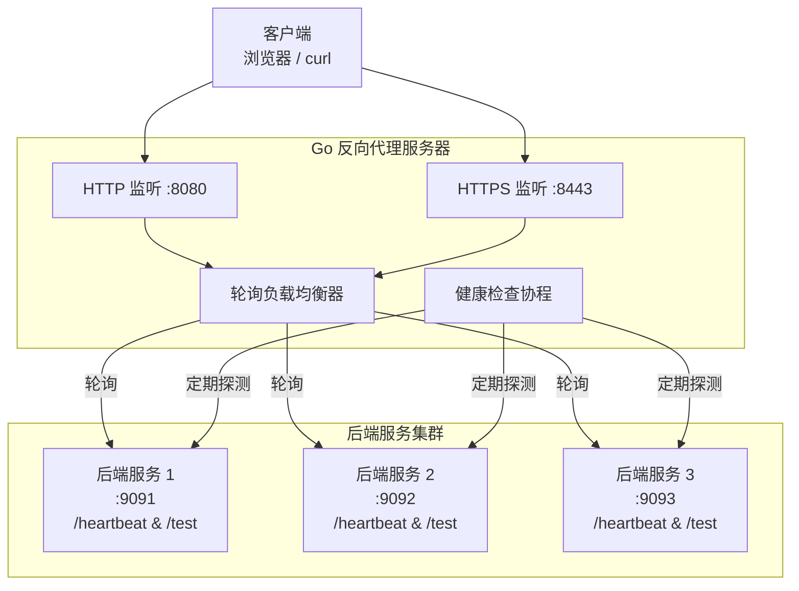
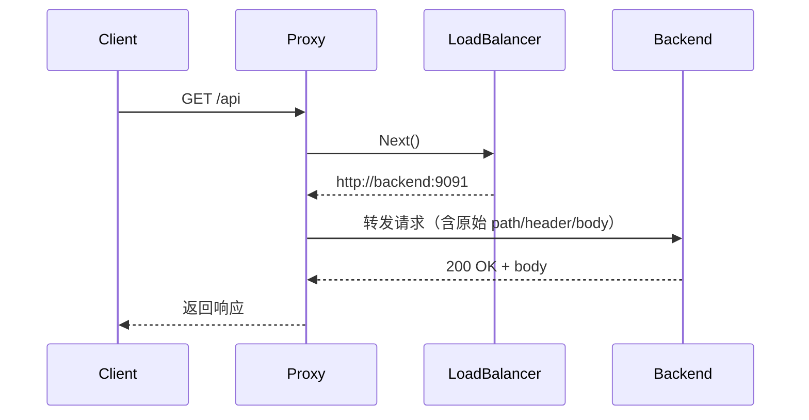
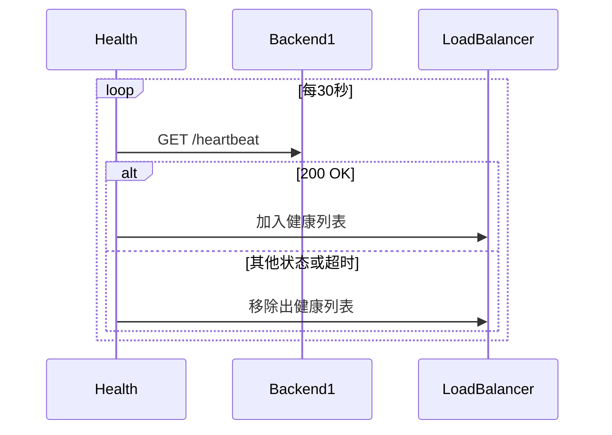

# **Go 反向代理服务器 – 系统设计文档**

---

> **项目名称**：se-go-web-server-2026
> 
> **版本**：v1.0
> 
> **日期**：2026-04-19
> 
> **编写人**: 刘灿阳   

---

[TOC]

---

## 一、系统架构

### 1.1 总体架构图（Mermaid）


### 1.2 核心组件说明
| 组件      | 技术选型                       | 职责                                                      |
| --------- | ------------------------------ | --------------------------------------------------------- |
| HTTP 服务 | 标准库 `net/http`              | 接收客户端请求，支持 HTTP/1.1 及 HTTP/2（TLS 下自动协商） |
| 反向代理  | `httputil.ReverseProxy`        | 转发请求到后端，自动处理逐跳头部、流式 body               |
| 负载均衡  | 自定义 `LoadBalancer`          | 原子轮询，管理健康后端列表                                |
| 健康检查  | 独立 goroutine + `time.Ticker` | 定期探测 `/heartbeat`，动态更新后端池                     |
| 配置管理  | `BurntSushi/toml`              | 解析 `config.toml`                                        |
| 日志      | `log/slog`（JSON 格式）        | 结构化日志，输出到 stdout / 文件                          |
| TLS       | `crypto/tls`                   | 加载证书，支持 TLS 1.2+                                   |

### 1.3 技术选型对比
| 决策                         | 理由                                   | 替代方案                     |
| ---------------------------- | -------------------------------------- | ---------------------------- |
| 使用标准库 `net/http`        | 无需引入第三方框架，性能足够，降低依赖 | Gin / Echo（增加复杂度）     |
| 使用 `httputil.ReverseProxy` | 成熟稳定，已处理大量边界情况           | 自己实现转发（易出错）       |
| 自定义原子轮询               | 轻量，满足需求，无额外依赖             | 使用 `roundrobin` 等第三方库 |
| 使用 `crypto/tls`            | Go 标准库 TLS 实现安全、简单           | 第三方库如 `utls`            |

---

## 二、模块详细设计

### 2.1 配置模块 (`config/`)
- **功能**：加载 `config.toml`，提供配置结构体。
- **关键结构**：
  ```go
  type Config struct {
      Listen    []Listen   `toml:"listen"`
      Forward   []Forward  `toml:"forward"`
      Heartbeat Heartbeat  `toml:"heartbeat"`
  }
  ```
- **加载逻辑**：`toml.DecodeFile` → 反序列化 → 校验端口范围、地址格式。

### 2.2 负载均衡模块 (`lb/`)
- **结构**：
  ```go
  type LoadBalancer struct {
      backends []*url.URL
      counter  atomic.Uint64
  }
  ```
- **方法**：`Next() *url.URL` 原子递增取模，返回下一个后端。
- **线程安全**：使用 `atomic.Uint64`，无锁。

### 2.3 健康检查模块 (`health/`)
- **功能**：独立 goroutine 定期遍历 `config.Forward`，对每个后端发起 `GET /heartbeat`，根据 2xx 响应决定是否加入 `LoadBalancer.backends`。
- **关键点**：
  - 使用 `http.Client` 设置超时（如 2 秒）。
  - 每次检查后更新 `lb.UpdateBackends(healthy)`。
  - 检查间隔可配置（如 30 秒）。

### 2.4 反向代理模块 (`proxy/`)
- **实现**：通过 `httputil.ReverseProxy` 的 `Director` 函数动态选择后端：
  ```go
  director := func(req *http.Request) {
      backend := lb.Next()
      req.URL.Scheme = backend.Scheme
      req.URL.Host = backend.Host
  }
  ```
- **错误处理**：自定义 `ErrorHandler` 返回 502/503。

### 2.5 TLS 模块
- **加载证书**：`tls.LoadX509KeyPair("cert.pem", "key.pem")`
- **配置**：`&tls.Config{MinVersion: tls.VersionTLS12, Certificates: []tls.Certificate{cert}}`
- **集成**：`http.Server{TLSConfig: tlsConfig}`

---

## 三、接口设计

### 3.1 外部接口
- **协议**：HTTP/HTTPS（TLS 1.2+）
- **监听端口**：HTTP 8080，HTTPS 8443（可配置）
- **转发规则**：所有路径（`/*`）均被代理到后端，保留原始 Method、Header、Body。
- **管理端点**（可选）：`GET /health` 返回当前健康后端列表（JSON）。

### 3.2 内部接口
- `LoadBalancer.Next() *url.URL`
- `StartHealthCheck(config, lb)` 启动后台协程
- `createReverseProxy(lb) *httputil.ReverseProxy`

---

## 四、数据流设计

### 4.1 请求处理时序图


---

### 4.2 健康检查时序图


---

## 五、安全设计
- **TLS**：最低 TLS 1.2，禁用弱加密套件（Go 默认已安全）。
- **头部过滤**：`httputil.ReverseProxy` 自动移除逐跳头部（`Connection`、`Keep-Alive` 等）。
- **超时控制**：`http.Client.Timeout` 限制后端响应时间，避免代理阻塞。
- **不记录敏感信息**：日志不包含请求体、Authorization 头（可配置）。

---

## 六、性能优化
- **并发模型**：每个请求在独立 goroutine 处理，Go 运行时自动负载均衡。
- **连接池**：`http.Transport` 默认维护空闲连接池，复用 TCP 连接。
- **零拷贝**：`ReverseProxy` 直接转发 body 流，无需读入内存。
- **GOMAXPROCS**：默认等于 CPU 核数，无需手动设置。

---

## 七、扩展性与维护性
- **模块化**：`config`、`lb`、`health`、`proxy` 包独立，可单独测试或替换。
- **配置驱动**：所有可变参数通过 `config.toml` 管理，支持热重载（可选）。
- **单元测试**：每个包提供 `_test.go`，使用 `go test` 运行。

---

## 八、部署架构
- **单节点**：直接运行二进制或 Docker 容器。
- **多节点集群**（未来扩展）：可部署多个代理实例，前端使用 Nginx 或云负载均衡器。

---

## 九、附录

### 9.1 术语表
| 术语     | 说明                                               |
| -------- | -------------------------------------------------- |
| 反向代理 | 代表客户端向后端服务发起请求，并将响应返回给客户端 |
| 轮询     | 负载均衡算法，依次分发请求                         |
| 健康检查 | 定期探测后端服务可用性                             |

### 9.2 设计决策记录
| 决策                   | 理由                                       | 替代方案                  |
| ---------------------- | ------------------------------------------ | ------------------------- |
| 不使用 Gin 等框架      | 反向代理不需要路由、模板等特性，标准库足够 | Gin（增加依赖和复杂度）   |
| 健康检查不通过注册中心 | 简化设计，满足需求                         | Consul / etcd（过度设计） |
| 轮询算法不加权重       | 初始版本简单，后续可扩展                   | 加权轮询 / 最少连接       |

---