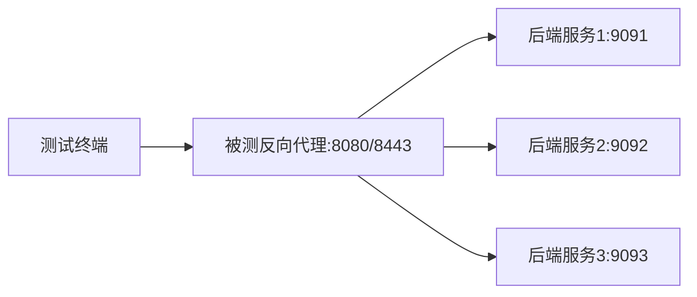

# **Go 反向代理服务器 – 用户验收测试计划**

---

> **项目名称**：se-go-web-server-2026
> 
> **版本**：v1.0
> 
> **日期**：2026-04-26
> 
> **编写人**: 刘灿阳   

---

[TOC]

---

## 一、引言

用户验收测试（UAT）是软件交付前由用户或客户代表执行的最终测试，旨在确认系统是否满足业务需求、功能规格和性能预期。本计划定义了 Go 反向代理服务器项目的用户验收测试范围、方法、环境和通过标准。

---

## 二、测试目标

- 验证所有核心功能（HTTP/HTTPS 转发、负载均衡、健康检查、配置管理、错误处理）符合需求规格说明书。
- 确认系统在高并发下的性能指标（QPS、延迟、错误率）达到预期标准。
- 检验 TLS 配置的安全性，确保仅支持现代协议。
- 收集用户反馈，为最终上线提供依据。

---

## 三、测试范围

| 测试类型   | 覆盖内容                                                      |
| ---------- | ------------------------------------------------------------- |
| 功能验证   | 代理转发、负载均衡、健康检查、多端口监听、错误处理（503/502） |
| 性能验证   | 不同并发下的 QPS、平均延迟、P95/P99 延迟、错误率              |
| 安全验证   | TLS 协议版本（TLS 1.2+）、证书有效性                          |
| 稳定性验证 | 持续负载下的系统表现                                          |

---

## 四、测试环境

### 4.1 硬件配置

| 组件 | 规格                                             |
| ---- | ------------------------------------------------ |
| CPU  | 12th Gen Intel(R) Core(TM) i5-12450H (8核12线程) |
| 内存 | 16GB DDR5                                        |
| 网络 | 本地回环（127.0.0.1）                            |

### 4.2 软件配置

| 软件       | 版本/说明                                         |
| ---------- | ------------------------------------------------- |
| 操作系统   | Windows 11 专业版 / Linux (压测补充)              |
| Go 编译器  | go 1.25.4                                         |
| 被测服务器 | Go 反向代理（本重构项目 v1.0）                    |
| 后端服务   | Rust 后端（监听 9091、9092、9093）                |
| 测试工具   | curl、ab (ApacheBench 2.3)、go-wrk (0.1)、openssl |

### 4.3 网络拓扑

---

## 五、测试角色与职责

| 角色       | 职责                                                   |
| ---------- | ------------------------------------------------------ |
| 测试负责人 | 制定测试计划、准备测试环境、协调测试资源、审核测试报告 |
| 测试执行者 | 执行测试用例、记录测试结果、提交缺陷                   |
| 客户代表   | 确认测试用例、参与验收、签署验收报告                   |

---

## 六、测试用例设计

### 6.1 功能测试用例

| 编号  | 测试项           | 操作步骤                                         | 预期结果                                 |
| ----- | ---------------- | ------------------------------------------------ | ---------------------------------------- |
| FT-01 | HTTP 转发        | `curl http://localhost:8080/test`                | 返回后端响应，内容包含后端端口号         |
| FT-02 | HTTPS 转发       | `curl.exe -k -v https://localhost:8443/test`     | 同上                                     |
| FT-03 | 负载均衡（轮询） | 连续执行 10 次 `curl http://localhost:8080/test` | 响应中的端口号在 9091、9092、9093 间轮询 |
| FT-04 | 健康检查剔除     | 停止后端 9091，等待 30+ 秒后连续请求             | 请求不再转发到 9091                      |
| FT-05 | 健康检查恢复     | 重启 9091，等待 30+ 秒后请求                     | 9091 重新出现在轮询中                    |
| FT-06 | 所有后端不可用   | 停止所有后端，请求 `/test`                       | 返回 503 Service Unavailable             |
| FT-07 | 无效路径         | `curl http://localhost:8080/notexist`            | 返回 404                                 |
| FT-08 | 日志输出         | 检查控制台和 `log.txt`                           | JSON 格式，包含级别、时间、消息          |

### 6.2 性能测试用例

| 编号  | 测试项     | 并发数 | 总请求数 | 测试命令                                                  | 通过标准                          |
| ----- | ---------- | ------ | -------- | --------------------------------------------------------- | --------------------------------- |
| PT-01 | 低并发基准 | 10     | 10000    | `ab -n 10000 -c 10 http://localhost:8080/test`            | QPS ≥ 4000，错误率 0，P95 ≤ 5ms   |
| PT-02 | 中并发基准 | 50     | 30000    | `ab -n 30000 -c 50 http://localhost:8080/test`            | QPS ≥ 4000，错误率 0，P95 ≤ 20ms  |
| PT-03 | 较高并发   | 100    | 50000    | `ab -n 50000 -c 100 http://localhost:8080/test`           | QPS ≥ 4000，错误率 0，P95 ≤ 30ms  |
| PT-04 | 高并发     | 200    | 100000   | `ab -n 100000 -c 200 http://localhost:8080/test`          | QPS ≥ 3800，错误率 0，P95 ≤ 70ms  |
| PT-05 | 高并发     | 500    | 500000   | `ab -n 500000 -c 500 http://localhost:8080/test`          | QPS ≥ 3500，错误率 0，P99 ≤ 150ms |
| PT-06 | 稳定性测试 | 100    | 250000   | `go-wrk -c=100 -t=8 -n=250000 http://localhost:8080/test` | 持续运行无错误，QPS 波动 ≤ 10%    |
| PT-07 | 稳定性测试 | 200    | 250000   | `go-wrk -c=200 -t=8 -n=250000 http://localhost:8080/test` | QPS ≥ 4500，错误率 0，P99 ≤ 100ms |

### 6.3 安全测试用例

| 编号  | 测试项       | 操作步骤                                                            | 预期结果                                     |
| ----- | ------------ | ------------------------------------------------------------------- | -------------------------------------------- |
| ST-01 | TLS 1.2 支持 | `openssl s_client -connect localhost:8443 -tls1_2`                  | 握手成功，返回证书                           |
| ST-02 | TLS 1.3 支持 | `openssl s_client -connect localhost:8443 -tls1_3`                  | 握手成功                                     |
| ST-03 | TLS 1.1 禁用 | `openssl s_client -connect localhost:8443 -tls1_1`                  | 握手失败（符合预期）                         |
| ST-04 | 证书有效性   | `openssl s_client -connect localhost:8443 -showcerts`               | 证书链完整，未过期                           |
| ST-05 | 安全扫描补充 | (可选) 使用 `sslscan localhost:8443` 或 `testssl.sh localhost:8443` | 无高危漏洞，TLS 版本仅 1.2/1.3，加密套件安全 |

> **说明**：ST-05 为推荐补充项，对应需求规格书 NFR-04 要求，可使用 `sslscan` 或 `testssl.sh` 进行更全面的安全性检查。

---

## 七、测试执行流程

1. **准备阶段**：搭建测试环境，确保后端服务正常运行；确认被测服务器版本为最终发布版本。
2. **执行阶段**：按顺序执行功能→性能→安全测试用例，记录实际结果，保存原始输出文件。
3. **问题处理**：对发现的问题分类，开发修复后回归测试。
4. **验收报告**：汇总测试结果，生成用户验收测试报告，客户代表签署。

---

## 八、通过标准

- **功能测试**：所有 FT 用例 100% 通过。
- **性能测试**：所有 PT 用例达到规定的 QPS 和延迟标准，错误率为 0。
- **安全测试**：所有 ST 用例通过，无高危漏洞。
- **稳定性测试**：长时间运行无错误，资源使用平稳。

---

## 九、交付物

1. 用户验收测试报告
2. 原始测试数据文件（ab、go-wrk 输出）
3. 安全测试截图（openssl 输出）

---